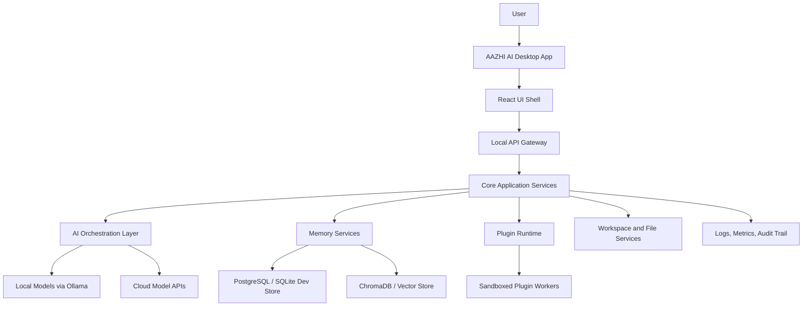

# AAZHI AI Architecture Documentation

**Product:** AAZHI AI (ஆழி AI)  
**Meaning:** Depth, limitless knowledge, intelligence, and the vast ocean  
**Document Status:** Planning and architecture, pre-implementation  
**Audience:** Founders, product leaders, designers, architects, engineers, security reviewers, DevOps teams

## Documentation Set

| # | Document | Purpose |
|---:|---|---|
| 1 | [01_EXECUTIVE_SUMMARY.md](01_EXECUTIVE_SUMMARY.md) | Vision, mission, product goals, and long-term direction |
| 2 | [02_PRD.md](02_PRD.md) | Product requirements, target users, problems, solutions, and differentiation |
| 3 | [03_SRS.md](03_SRS.md) | Functional and non-functional software requirements |
| 4 | [04_HIGH_LEVEL_ARCHITECTURE.md](04_HIGH_LEVEL_ARCHITECTURE.md) | Complete module map and system-level design |
| 5 | [05_LOW_LEVEL_ARCHITECTURE.md](05_LOW_LEVEL_ARCHITECTURE.md) | Frontend, backend, API, AI, storage, and security layers |
| 6 | [06_TECHNOLOGY_STACK.md](06_TECHNOLOGY_STACK.md) | Recommended production technology choices |
| 7 | [07_FOLDER_STRUCTURE.md](07_FOLDER_STRUCTURE.md) | Enterprise-level repository and package layout |
| 8 | [08_DATABASE_DESIGN.md](08_DATABASE_DESIGN.md) | Tables, relationships, indexes, and future expansion |
| 9 | [09_MEMORY_ARCHITECTURE.md](09_MEMORY_ARCHITECTURE.md) | Conversation, project, user, semantic, and vector memory |
| 10 | [10_AI_ARCHITECTURE.md](10_AI_ARCHITECTURE.md) | Model, prompt, context, reasoning, image, voice, and agent pipelines |
| 11 | [11_PLUGIN_ARCHITECTURE.md](11_PLUGIN_ARCHITECTURE.md) | Plugin SDK, permissions, runtime, marketplace, and future plugins |
| 12 | [12_SECURITY_ARCHITECTURE.md](12_SECURITY_ARCHITECTURE.md) | Auth, authorization, encryption, sandboxing, secrets, and audit logs |
| 13 | [13_UI_UX_ARCHITECTURE.md](13_UI_UX_ARCHITECTURE.md) | Navigation, screens, themes, accessibility, and design principles |
| 14 | [14_BRANDING.md](14_BRANDING.md) | Tamil identity, logo concept, voice, colors, and meaning |
| 15 | [15_DEVELOPMENT_ROADMAP.md](15_DEVELOPMENT_ROADMAP.md) | Phased build plan with difficulty estimates |
| 16 | [16_DOCUMENTATION_GUIDE.md](16_DOCUMENTATION_GUIDE.md) | README, architecture guide, developer guide, standards, and contribution docs |
| 17 | [TASKS.md](TASKS.md) | Complete implementation checklist with independently completable tasks |
| 18 | [ROADMAP.md](ROADMAP.md) | Version roadmap for 1.0, 2.0, and 3.0 |
| 19 | [19_PRE_DEVELOPMENT_RECOMMENDATIONS.md](19_PRE_DEVELOPMENT_RECOMMENDATIONS.md) | Recommended decisions before engineering begins |

## Architecture Principles

| Principle | Meaning |
|---|---|
| Local-first where possible | User data, local models, and project context should work offline when feasible. |
| Cloud-optional intelligence | Cloud models improve power, but the product must remain useful without them. |
| Privacy by design | Memory, files, prompts, and secrets require explicit permission boundaries. |
| Modular AI runtime | Chat, coding, image, voice, and agents share common model, prompt, memory, and tool layers. |
| Extensible platform | Plugin APIs, workspace APIs, and agent APIs must be stable enough for years of expansion. |
| Professional UX | The app should feel like a serious creative and engineering environment, not a toy chatbot. |

## Core System Diagram

## Recommended First Decision Gates

| Gate | Decision Needed |
|---|---|
| Product scope | Define MVP boundaries for chat, coding, local models, and memory. |
| Data policy | Decide which data is local-only, cloud-syncable, and shareable with model APIs. |
| Model policy | Choose supported local and cloud model providers for version 1.0. |
| Plugin policy | Decide whether external plugins ship in 1.0 or remain internal/private until 2.0. |
| Distribution | Choose release platforms, updater strategy, signing certificates, and store strategy. |

