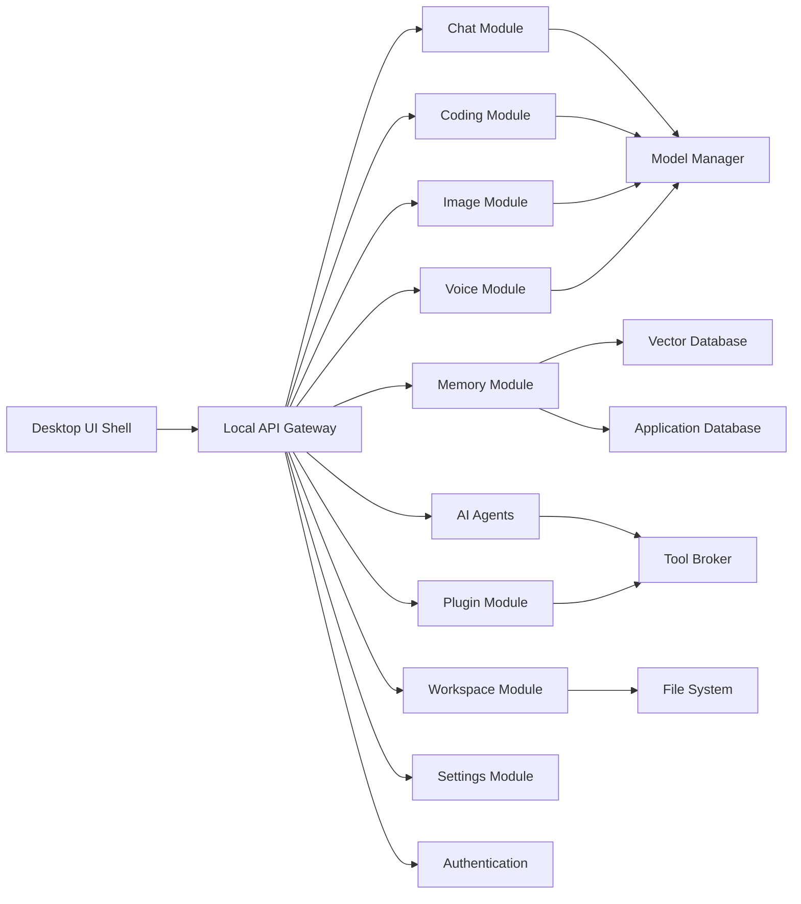
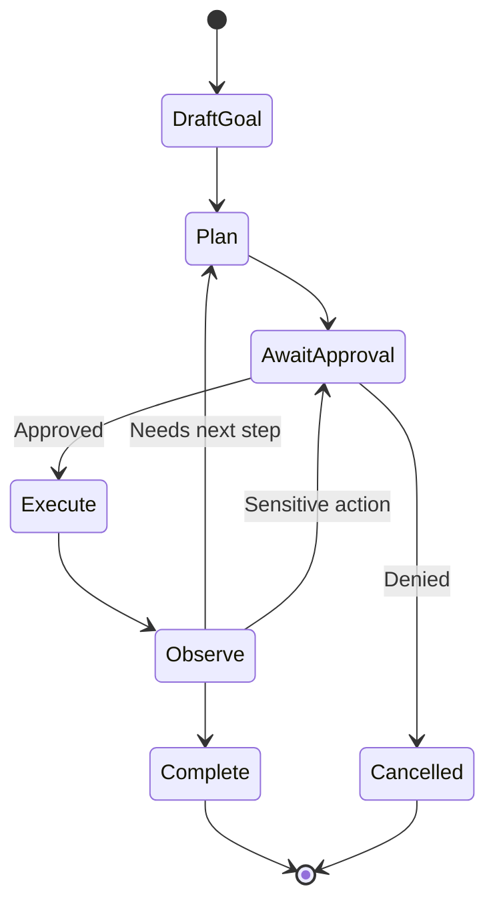

# 4. High-Level Architecture

## System Overview

AAZHI AI should be structured as a desktop shell with local backend services. The UI is responsible for interaction and visualization. The backend owns state, security, model orchestration, plugin execution, memory, file access, and integrations.

## Module Map

| Module | Responsibility |
|---|---|
| Chat Module | Conversations, message streaming, attachments, branches, summaries, citations. |
| Memory Module | User memory, project memory, conversation memory, semantic search, retention policy. |
| Coding Module | Code explanation, generation, editing proposals, review, tests, repository context. |
| Image Module | Text-to-image, image-to-image, inpainting, prompt templates, asset library. |
| Voice Module | Speech input, speech output, wake mode, transcription, conversational voice state. |
| Plugin Module | Plugin discovery, installation, lifecycle, permissions, sandboxed execution. |
| Model Manager | Local/cloud model registry, routing, health checks, capabilities, cost and latency policy. |
| Authentication | Local profile, optional cloud account, organization identity, SSO-ready design. |
| Database | Relational state, vector embeddings, cache, audit logs, migrations. |
| Settings | User preferences, provider settings, privacy controls, accessibility, themes. |
| File Explorer | Workspace tree, file preview, search, permissions, indexing status. |
| Project Workspace | Project identity, files, tasks, memories, conversations, plugin config. |
| AI Agents | Goal planning, tool use, approval gates, execution state, rollback metadata. |

## Chat Module

| Component | Description |
|---|---|
| Conversation service | Creates and manages threads, messages, branches, metadata, and summaries. |
| Streaming service | Handles token streaming, cancellation, retry, and partial state persistence. |
| Attachment service | Handles files, images, audio, and selected workspace context. |
| Citation service | Tracks sources from files, memory, tools, and web/plugin results. |
| Conversation summarizer | Creates compact summaries for long-running threads. |

## Memory Module

| Component | Description |
|---|---|
| Memory classifier | Detects candidate memories from conversations and project events. |
| Memory approval policy | Determines auto-save, ask-first, or never-save behavior. |
| Memory store | Stores facts, preferences, decisions, project notes, and summaries. |
| Embedding service | Converts text chunks into vectors for semantic search. |
| Retrieval service | Finds relevant memories and injects them into context. |
| Memory UI | Allows users to inspect, edit, pin, archive, and delete memory. |

## Coding Module

| Component | Description |
|---|---|
| Repo indexer | Builds file tree, language metadata, symbol map, and embeddings. |
| Code context builder | Selects relevant files, snippets, diagnostics, and recent changes. |
| Code assistant | Explains, generates, reviews, tests, and proposes patches. |
| Diff engine | Presents suggested edits as reviewable changes. |
| Test runner bridge | Executes tests only with user approval and scoped permissions. |

## Image Module

| Component | Description |
|---|---|
| Prompt builder | Creates structured prompts, negative prompts, style controls, and presets. |
| Generation service | Routes jobs to local or cloud image models. |
| Editing service | Handles image-to-image, inpainting, outpainting, and reference-based edits. |
| Asset library | Stores generated images, metadata, seeds, prompts, and versions. |
| Safety and policy layer | Applies provider requirements, local moderation policy, and user controls. |

## Voice Module

| Component | Description |
|---|---|
| Speech-to-text | Converts user speech to text using local or cloud providers. |
| Text-to-speech | Produces spoken responses with selectable voices. |
| Voice session manager | Tracks interruptions, turn-taking, and live conversation state. |
| Audio device manager | Manages microphone, speaker, noise suppression, and permissions. |

## Plugin Module

| Component | Description |
|---|---|
| Plugin registry | Lists installed and available plugins. |
| Manifest parser | Reads plugin name, version, permissions, commands, tools, and UI extensions. |
| Runtime manager | Starts, stops, updates, and isolates plugins. |
| Permission broker | Enforces file, network, secret, terminal, and workspace permissions. |
| Plugin API | Provides typed APIs for chat, workspace, memory, UI panels, and tool calls. |

## Model Manager

| Component | Description |
|---|---|
| Model registry | Tracks available local and cloud models. |
| Capability matrix | Describes chat, code, vision, image, embedding, audio, context length, tools. |
| Router | Chooses model by task, user preference, cost, privacy, speed, and availability. |
| Health monitor | Checks model availability and provider status. |
| Benchmark service | Measures latency, quality samples, memory use, and throughput. |

## Authentication

| Mode | Description |
|---|---|
| Local profile | No account required for local use. |
| Cloud account | Optional sign-in for sync, marketplace, cloud credits, collaboration. |
| Enterprise identity | Future SSO/SAML/OIDC support with organization policies. |

## Database

| Store | Role |
|---|---|
| PostgreSQL | Production relational data for cloud sync and enterprise services. |
| SQLite | Optional local embedded store for single-user offline mode. |
| ChromaDB | Local vector database for embeddings and semantic search. |
| Object storage | Images, attachments, exports, logs, and model artifacts. |
| Secure key store | API keys, tokens, and secrets through OS keychain. |

## Settings

Settings should include models, providers, privacy, memory, plugins, workspace defaults, appearance, accessibility, updates, telemetry, keyboard shortcuts, and security.

## File Explorer

The file explorer must support user-selected folders only. It should show indexing status, file permissions, ignored paths, previews, and AI usage indicators.

## Project Workspace

A workspace bundles:

| Item | Examples |
|---|---|
| Files | Source code, docs, images, notes |
| Conversations | Project-specific chat threads |
| Memories | Decisions, architecture notes, user preferences |
| Model config | Preferred code model, embedding model, privacy mode |
| Plugins | Enabled tools and integrations |
| Agents | Saved tasks and workflows |

## AI Agents

Agents should be supervised by default.

