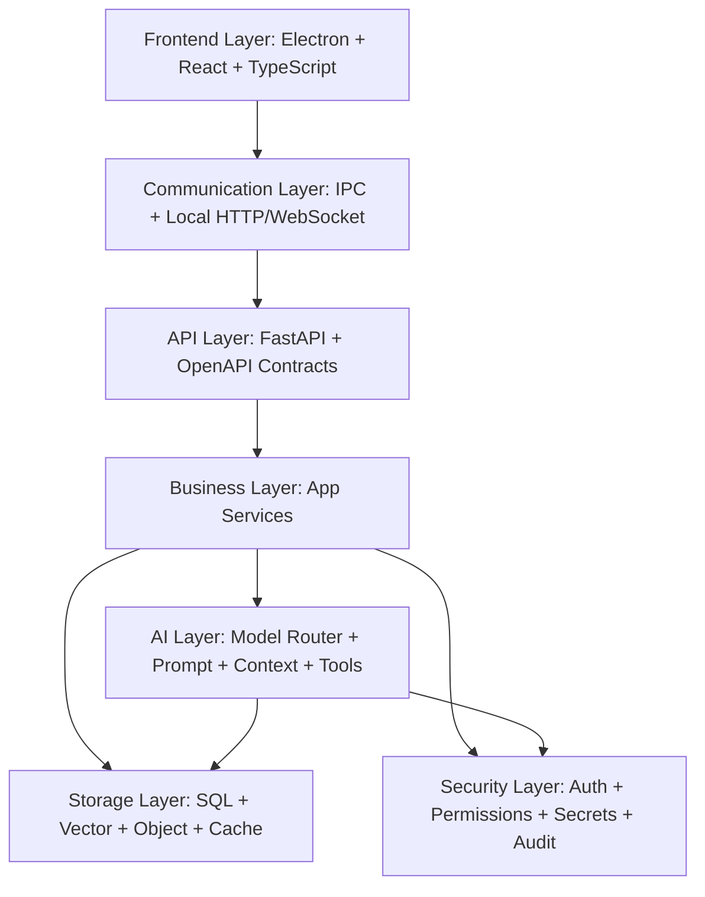
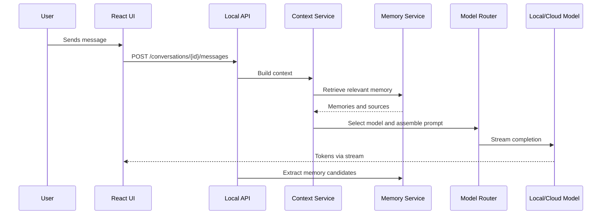

# 5. Low-Level Architecture

## Layered Architecture

## Frontend

| Area | Design |
|---|---|
| Shell | Electron desktop shell with secure preload bridge and disabled unsafe Node access in renderer. |
| UI | React with TypeScript, Tailwind CSS, accessible component primitives, and state machines for complex flows. |
| State | Local UI state through Zustand or Redux Toolkit; server state through TanStack Query. |
| Routing | Workspace-aware navigation with deep links to conversations, files, images, settings, and plugins. |
| Rendering | Virtualized lists for long chats, histories, files, and logs. |
| Streaming | Token and progress streaming over WebSocket or Server-Sent Events from local API. |

## Backend

| Area | Design |
|---|---|
| Runtime | Python FastAPI service launched and supervised by Electron. |
| Services | Domain services for chat, memory, models, files, images, voice, agents, plugins, and settings. |
| Workers | Background worker pool for indexing, embeddings, image jobs, transcription, and plugin jobs. |
| Contracts | OpenAPI-generated TypeScript client for frontend/backend type alignment. |
| Persistence | Repository pattern over SQL and vector stores. |
| Migrations | Alembic for SQL schema evolution. |

## Communication

| Channel | Usage |
|---|---|
| Electron IPC | App lifecycle, native dialogs, secure OS integration, window management. |
| Local HTTP API | CRUD operations, settings, project data, memory, plugin management. |
| WebSocket/SSE | Chat streaming, agent status, image job progress, indexing progress, voice events. |
| Message bus | Internal async events for indexing, memory extraction, audit logs, and plugin lifecycle. |

## API Layer

| API Group | Endpoints |
|---|---|
| Conversations | Create, list, update, delete, stream messages, branch, summarize. |
| Models | List, configure, health check, benchmark, select defaults. |
| Memory | List, search, create, update, delete, export, import. |
| Workspaces | Create, open, index, search files, configure permissions. |
| Images | Create job, edit job, get status, list assets, export. |
| Voice | Start session, stop session, transcribe, synthesize. |
| Plugins | Install, enable, disable, configure, run command, inspect permissions. |
| Agents | Create goal, approve action, pause, resume, cancel, inspect logs. |
| Settings | Get, update, reset, export, import. |

## Business Layer

| Service | Responsibilities |
|---|---|
| ConversationService | Thread state, messages, branching, summaries, citations. |
| ContextService | Builds context from messages, memory, files, tools, and settings. |
| MemoryService | Memory extraction, approval, embedding, retrieval, lifecycle. |
| WorkspaceService | File permissions, indexing, search, project metadata. |
| ModelService | Provider configs, routing, health, cost, capabilities. |
| PluginService | Manifest validation, lifecycle, permission checks. |
| AgentService | Planning, execution loop, approval gates, tool results. |
| AuditService | Security, plugin, agent, model, and data access events. |

## AI Layer

| Component | Description |
|---|---|
| Model adapters | Unified interface for Ollama, OpenAI-compatible APIs, image providers, embedding providers, STT, and TTS. |
| Prompt manager | Versioned system prompts, task prompts, style presets, and safety prompts. |
| Context builder | Token budgeting, retrieval, summarization, source ranking, and redaction. |
| Tool broker | Mediates AI tool calls through permissions and audit logs. |
| Reasoning pipeline | Plan, retrieve, reason, execute tools, verify, respond. |
| Evaluation hooks | Capture samples for prompt/model regression testing with privacy controls. |

## Storage Layer

| Store | Data |
|---|---|
| Relational database | Users, workspaces, conversations, messages, settings, plugins, audit logs. |
| Vector database | Memory embeddings, file chunks, conversation summaries, image text metadata. |
| Object storage | Attachments, generated images, audio files, exports, backups. |
| Cache | Model health, recent context, provider metadata, prompt templates. |
| OS keychain | API keys, refresh tokens, encryption keys, plugin secrets. |

## Security Layer

| Control | Description |
|---|---|
| Auth boundary | Local profile now, cloud identity later. |
| Authorization | Role and permission checks for workspaces, plugins, agents, and organization resources. |
| Secret isolation | Secrets are never exposed directly to renderer or plugins. |
| Sandbox | Plugins and agents run with scoped file, network, terminal, and memory access. |
| Audit | Every sensitive action emits structured audit events. |
| Redaction | Sensitive values are redacted from logs and optionally from cloud prompts. |

## Request Flow Example

