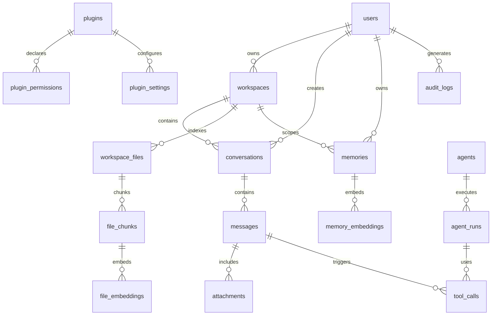

# 8. Database Design

## Storage Strategy

AAZHI AI should separate relational state, vector search data, object assets, and secrets.

| Store | Use |
|---|---|
| Relational database | Users, workspaces, conversations, messages, settings, plugins, jobs, audit events. |
| Vector database | Embeddings for memories, file chunks, conversation summaries, and asset metadata. |
| Object storage | Attachments, images, audio, exports, backups. |
| OS keychain | API keys, tokens, encryption keys, plugin secrets. |

## Core Entity Relationship Diagram

## Tables

### `users`

| Column | Type | Notes |
|---|---|---|
| `id` | UUID | Primary key |
| `display_name` | Text | Local profile name |
| `email` | Text | Nullable until cloud account |
| `avatar_url` | Text | Nullable |
| `created_at` | Timestamp | Required |
| `updated_at` | Timestamp | Required |

### `workspaces`

| Column | Type | Notes |
|---|---|---|
| `id` | UUID | Primary key |
| `owner_user_id` | UUID | FK to users |
| `name` | Text | Required |
| `root_path_hash` | Text | Avoid storing sensitive paths unencrypted where possible |
| `root_path_encrypted` | Text | Encrypted local path |
| `privacy_mode` | Text | `local_only`, `cloud_allowed`, `enterprise_policy` |
| `created_at` | Timestamp | Required |
| `updated_at` | Timestamp | Required |

### `conversations`

| Column | Type | Notes |
|---|---|---|
| `id` | UUID | Primary key |
| `workspace_id` | UUID | Nullable for global chats |
| `user_id` | UUID | FK to users |
| `title` | Text | Required |
| `status` | Text | `active`, `archived`, `deleted` |
| `default_model_id` | Text | Nullable |
| `summary` | Text | Rolling summary |
| `created_at` | Timestamp | Required |
| `updated_at` | Timestamp | Required |

### `messages`

| Column | Type | Notes |
|---|---|---|
| `id` | UUID | Primary key |
| `conversation_id` | UUID | FK |
| `parent_message_id` | UUID | Supports branches |
| `role` | Text | `system`, `user`, `assistant`, `tool` |
| `content` | Text | Message body |
| `model_id` | Text | Model that generated response |
| `token_count` | Integer | Nullable |
| `metadata_json` | JSONB | Citations, safety, timings |
| `created_at` | Timestamp | Required |

### `memories`

| Column | Type | Notes |
|---|---|---|
| `id` | UUID | Primary key |
| `user_id` | UUID | FK |
| `workspace_id` | UUID | Nullable |
| `source_conversation_id` | UUID | Nullable |
| `type` | Text | `user`, `project`, `conversation`, `preference`, `decision` |
| `content` | Text | Memory content |
| `confidence` | Float | Extraction confidence |
| `visibility` | Text | `private`, `workspace`, `organization` |
| `status` | Text | `active`, `archived`, `deleted`, `pending_approval` |
| `created_at` | Timestamp | Required |
| `updated_at` | Timestamp | Required |

### `plugins`

| Column | Type | Notes |
|---|---|---|
| `id` | UUID | Primary key |
| `name` | Text | Required |
| `publisher` | Text | Required |
| `version` | Text | Semver |
| `manifest_json` | JSONB | Validated manifest |
| `enabled` | Boolean | Required |
| `install_source` | Text | local, marketplace, enterprise |
| `created_at` | Timestamp | Required |

### `audit_logs`

| Column | Type | Notes |
|---|---|---|
| `id` | UUID | Primary key |
| `user_id` | UUID | Nullable for system events |
| `workspace_id` | UUID | Nullable |
| `event_type` | Text | Required |
| `actor_type` | Text | user, agent, plugin, system |
| `actor_id` | Text | Nullable |
| `resource_type` | Text | Required |
| `resource_id` | Text | Nullable |
| `risk_level` | Text | low, medium, high, critical |
| `metadata_json` | JSONB | Redacted details |
| `created_at` | Timestamp | Required |

## Indexes

| Table | Index | Purpose |
|---|---|---|
| `conversations` | `(user_id, updated_at DESC)` | Fast conversation list. |
| `conversations` | `(workspace_id, updated_at DESC)` | Workspace chat list. |
| `messages` | `(conversation_id, created_at)` | Ordered message loading. |
| `memories` | `(user_id, status, updated_at DESC)` | Memory management UI. |
| `memories` | `(workspace_id, type, status)` | Project memory retrieval. |
| `workspace_files` | `(workspace_id, path_hash)` | File lookup and deduplication. |
| `audit_logs` | `(created_at DESC)` | Audit browsing. |
| `audit_logs` | `(workspace_id, event_type, created_at DESC)` | Workspace security review. |

## Future Expansion

| Future Need | Database Preparation |
|---|---|
| Organizations | Add `organizations`, `memberships`, roles, policies. |
| Collaboration | Add shared conversations, comments, presence, permissions. |
| Sync | Add device IDs, sync cursors, conflict metadata. |
| Marketplace | Add plugin listings, reviews, signatures, publisher verification. |
| Enterprise audit | Add immutable audit export and retention policies. |
| Knowledge graph | Add entities, relationships, source spans, confidence scores. |

