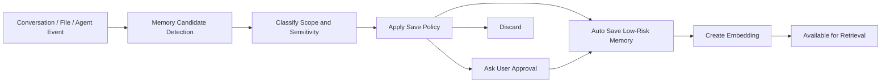

# 9. Memory Architecture

## Memory Goals

AAZHI AI memory should make the assistant more useful over time without making users feel surveilled. The product must provide transparency, control, deletion, and clear scope.

## Memory Types

| Type | Scope | Examples |
|---|---|---|
| Conversation memory | Single thread | Summary, decisions, unresolved questions, preferences in that chat. |
| Project memory | Workspace/project | Architecture decisions, coding style, product goals, file conventions. |
| User memory | User profile | Name, preferred tone, recurring goals, favorite tools, accessibility needs. |
| Task memory | Agent/task run | Plan, actions, approvals, results, rollback notes. |
| Semantic file memory | Workspace files | Embedded chunks and source references. |

## Memory Flow

## Conversation Memory

| Component | Description |
|---|---|
| Rolling summary | Compact summary updated as conversation grows. |
| Decision extraction | Captures decisions, assumptions, and user corrections. |
| Topic map | Identifies recurring themes and current task state. |
| Branch awareness | Keeps memory tied to the correct conversation branch. |

## Project Memory

| Component | Description |
|---|---|
| Project facts | Product goals, architecture choices, dependencies, conventions. |
| Source-aware entries | Each memory links back to the conversation, file, or user action that created it. |
| Workspace scoping | Project memories are only used inside the matching workspace by default. |
| Team-ready model | Future support for shared project memory with roles and approvals. |

## User Memory

| Component | Description |
|---|---|
| Preferences | Preferred tone, formatting, model choices, workflows. |
| Long-term context | Stable facts the user explicitly wants remembered. |
| Privacy controls | Inspect, edit, delete, disable, export. |
| Sensitivity filtering | Avoid saving secrets, credentials, personal identifiers, and regulated data by default. |

## Semantic Search

Semantic search should combine vector similarity with structured filters.

| Step | Description |
|---|---|
| Chunk | Split content by semantic boundaries, code symbols, or document sections. |
| Embed | Generate embeddings using local or configured embedding model. |
| Store | Save vector, metadata, source, scope, and permission tags. |
| Retrieve | Search by query embedding and filter by workspace/user/visibility. |
| Rank | Re-rank by recency, trust, source, user pinning, and task relevance. |
| Cite | Return source references to the context builder and UI. |

## Vector Storage

| Collection | Contents |
|---|---|
| `user_memories` | User-level memory embeddings. |
| `project_memories` | Workspace-scoped memory embeddings. |
| `conversation_summaries` | Thread and branch summaries. |
| `file_chunks` | Indexed source files and documents. |
| `asset_metadata` | Generated image prompts, descriptions, tags. |

## Memory Permission Model

| Action | Required Control |
|---|---|
| Save memory | Policy check; approval for sensitive or uncertain entries. |
| Use memory in local model | Allowed if memory scope matches active context. |
| Send memory to cloud model | Requires provider policy and privacy setting. |
| Share memory with plugin | Requires plugin permission and user scope approval. |
| Delete memory | Immediate soft delete plus optional hard delete/compaction. |

## Memory UI Requirements

| Screen | Capabilities |
|---|---|
| Memory dashboard | Search, filter, edit, delete, export. |
| Memory detail | Source, created date, confidence, usage history. |
| Project memory panel | Workspace-specific facts and decisions. |
| Privacy settings | Turn memory on/off by type and provider. |
| Chat controls | Save this, forget this, do not remember from this chat. |

