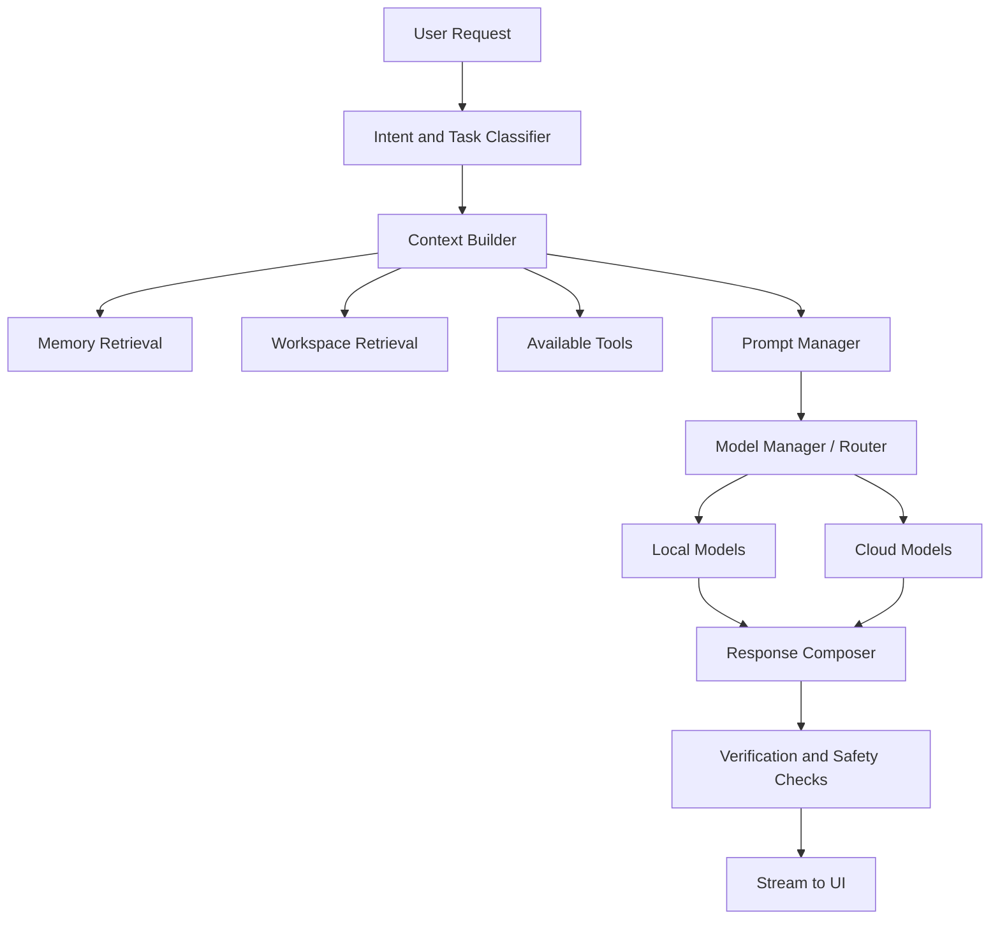
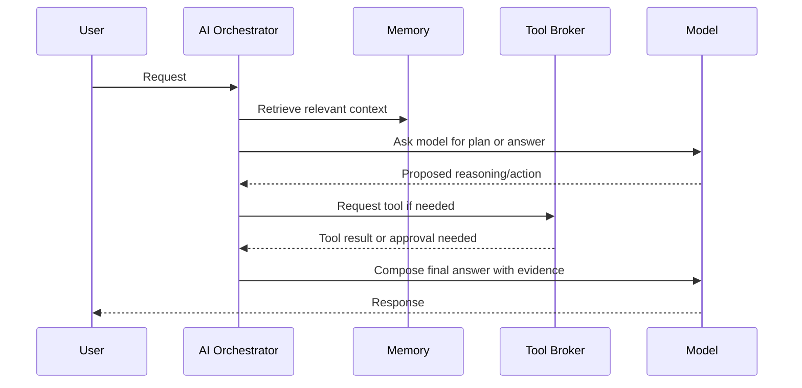

# 10. AI Architecture

## AI Design Principle

AAZHI AI should use a shared AI orchestration layer across chat, coding, memory, image, voice, and agents. Each feature should not build its own isolated model logic.

## Core AI Architecture

## Model Manager

| Responsibility | Description |
|---|---|
| Registry | Track installed, configured, and available models. |
| Capabilities | Record chat, code, vision, image, embedding, audio, tools, context length. |
| Routing | Select model by task, privacy, cost, speed, quality, and availability. |
| Fallback | Retry with fallback model when primary fails. |
| Health | Check local and cloud providers. |
| Benchmark | Measure latency, throughput, memory usage, and quality samples. |

## Prompt Manager

| Feature | Description |
|---|---|
| Versioned prompts | Prompts should be stored with names, versions, owners, and changelogs. |
| Task templates | Separate templates for chat, code, review, image, memory extraction, agents. |
| Locale and identity | Support Tamil-inspired product voice while remaining globally clear. |
| Safety prompts | Provider-specific and internal safety constraints. |
| Evaluation hooks | Prompt changes should be tested against regression suites. |

## Conversation Manager

| Responsibility | Description |
|---|---|
| Thread state | Messages, branches, summaries, attachments, citations. |
| Token budgeting | Keeps context under model limits. |
| Branching | Enables alternate answers and experimental paths. |
| Summarization | Compresses long histories while preserving decisions and open tasks. |
| Source tracking | Records memories, files, tools, and model outputs used in each response. |

## Context Builder

| Input | Handling |
|---|---|
| Recent messages | Include direct conversational context. |
| Long conversation | Include rolling summary and selected important turns. |
| User memory | Include relevant approved user memories. |
| Project memory | Include relevant workspace decisions and facts. |
| File context | Include selected files, retrieved snippets, and source metadata. |
| Tool results | Include structured outputs with citations. |
| Privacy policy | Redact or exclude sensitive context for cloud models. |

## Reasoning Pipeline

## Image Pipeline

| Stage | Description |
|---|---|
| Prompt intake | User prompt, style, aspect ratio, references, negative prompt. |
| Prompt enrichment | Optional prompt improvement and safety classification. |
| Model routing | Choose local or cloud image model. |
| Job execution | Queue, progress, cancellation, retries. |
| Asset storage | Save image, prompt, seed, model, parameters, lineage. |
| Editing | Inpainting, outpainting, variation, reference-guided edits. |

## Voice Pipeline

| Stage | Description |
|---|---|
| Capture | Microphone permission, device selection, noise suppression. |
| Transcribe | Local or cloud STT. |
| Interpret | Turn-taking, interruptions, command detection. |
| Respond | Chat/model pipeline. |
| Synthesize | Local or cloud TTS with selected voice. |
| Playback | Stream audio and allow interruption. |

## Future Agent Pipeline

| Stage | Description |
|---|---|
| Goal intake | User describes desired result. |
| Plan | Agent decomposes task into steps. |
| Risk classify | Each step receives a risk level. |
| Approval | Sensitive steps require explicit permission. |
| Execute | Tools run through permission broker. |
| Observe | Agent reads results and updates plan. |
| Verify | Agent checks output and summarizes changes. |
| Record | Store audit log, task memory, and reusable workflow. |

