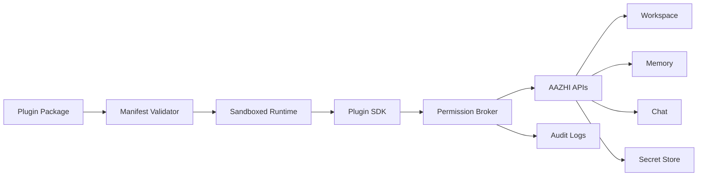

# 11. Plugin Architecture

## Plugin Vision

AAZHI AI should become a platform where trusted extensions can add tools, UI panels, integrations, model providers, agent skills, and workflow automations without compromising user privacy or app stability.

## Plugin Principles

| Principle | Meaning |
|---|---|
| Explicit permissions | Plugins must declare capabilities before installation and execution. |
| Sandboxed runtime | Plugins run outside the renderer and cannot access secrets or files directly. |
| Stable SDK | Plugin APIs are versioned and backward compatible where possible. |
| User control | Users can enable, disable, inspect, and remove plugins. |
| Auditability | Plugin actions are logged with actor, resource, permission, and timestamp. |

## Plugin Manifest

| Field | Description |
|---|---|
| `id` | Unique plugin identifier. |
| `name` | Human-readable name. |
| `publisher` | Author or organization. |
| `version` | Semantic version. |
| `aazhiApiVersion` | Required plugin API version. |
| `description` | Short plugin description. |
| `permissions` | File, network, secrets, workspace, memory, model, terminal scopes. |
| `commands` | User-facing commands exposed by the plugin. |
| `tools` | AI-callable tools exposed through the tool broker. |
| `ui` | Optional panels, settings screens, or sidebar contributions. |
| `entry` | Runtime entry point. |

## Runtime Architecture

## Plugin SDK Areas

| SDK Area | Capabilities |
|---|---|
| Chat API | Add commands, context providers, message actions. |
| Workspace API | Read approved files, add virtual views, index supported files. |
| Memory API | Request scoped memory read/write with user approval. |
| Tool API | Expose AI-callable tools with schemas and permission requirements. |
| UI API | Add panels, settings pages, status items, command palette actions. |
| Secret API | Request named secrets without reading raw values unless permitted. |
| Agent API | Contribute tools and task templates to supervised agents. |
| Model API | Register provider adapters or specialized model capabilities. |

## Permission Model

| Permission | Examples |
|---|---|
| `workspace.read` | Read selected workspace files. |
| `workspace.write` | Write files only after user-approved scope. |
| `network.request` | Access declared domains. |
| `secrets.use` | Use named secret for API call without exposing it. |
| `memory.read` | Retrieve scoped memories. |
| `memory.write` | Create candidate memories. |
| `terminal.run` | Execute approved commands. |
| `models.call` | Use configured model providers. |
| `ui.contribute` | Add UI panels or commands. |

## Future Plugins

| Plugin | Capabilities |
|---|---|
| GitHub | Issues, PRs, code review, repository context, release notes. |
| Docker | Container status, logs, compose control, dev environment setup. |
| AWS | Resource search, logs, cost summaries, deployment helpers. |
| Azure | Resource search, logs, identity-aware cloud operations. |
| VS Code | Open file, sync selected context, apply patches, editor handoff. |
| Figma | Inspect designs, export assets, design-to-code context. |
| WhatsApp | Draft replies, summarize conversations with strict privacy approval. |
| Browser | Web research, page summarization, browser automation with approval. |

## Marketplace Roadmap

| Phase | Capability |
|---|---|
| Private plugins | Local plugin loading for internal development. |
| Official plugins | Curated first-party plugins. |
| Signed plugins | Publisher signatures and integrity checks. |
| Marketplace | Discovery, installation, reviews, update channels. |
| Enterprise registry | Organization-approved plugin catalog and policy controls. |

