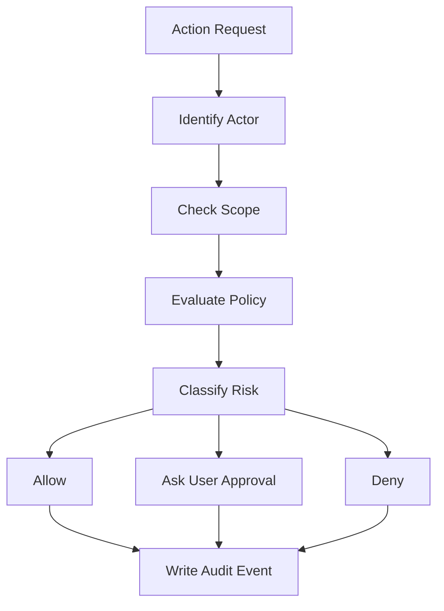

# 12. Security Architecture

## Security Goals

AAZHI AI must protect user data, workspace files, model prompts, memories, secrets, and agent/plugin actions. Trust is a core product feature.

## Threat Model Summary

| Threat | Control |
|---|---|
| Malicious plugin reads files | Sandboxed runtime and scoped file permissions. |
| Agent performs unsafe action | Risk classification, approval gates, audit logs. |
| API key leakage | OS keychain, secret proxy, redacted logs. |
| Prompt leaks sensitive data to cloud | Privacy policy, redaction, local-only mode. |
| Compromised update | Signed updates and signature verification. |
| Renderer compromise | Secure preload bridge, no direct Node access, strict CSP. |
| Data loss | Backups, export, migrations, sync conflict handling. |

## Authentication

| Mode | Description |
|---|---|
| Local-only | User can use the app without account creation. |
| Cloud account | Optional for sync, marketplace, collaboration, billing. |
| Enterprise | Future SSO through OIDC/SAML and organization policy enforcement. |

## Authorization

| Resource | Permission Examples |
|---|---|
| Workspace | read, write, index, delete, share. |
| Memory | read, create, update, delete, export. |
| Plugin | install, enable, configure, run. |
| Agent | create, approve action, pause, cancel. |
| Model provider | use, configure, disable, send cloud data. |
| Secrets | create, use, rotate, delete. |

## Permission System

## Encryption

| Data | Encryption Approach |
|---|---|
| API keys | OS keychain or secure credential manager. |
| Local database | Optional SQLCipher or encrypted fields for sensitive data. |
| Workspace paths | Store encrypted paths and hashes where possible. |
| Backups | Encrypted archive with user-controlled key. |
| Cloud sync | TLS in transit and encryption at rest. |

## Secrets Management

| Rule | Description |
|---|---|
| Never expose raw secrets to renderer | Renderer requests actions, backend uses secrets. |
| Plugins receive handles, not values | Secret proxy performs provider calls where feasible. |
| Redact logs | Secrets and credentials must be masked in logs and audit metadata. |
| Support rotation | Users can update or remove keys cleanly. |

## Sandbox

| Boundary | Requirement |
|---|---|
| Renderer | No direct filesystem, shell, or secret access. |
| Plugin runtime | Isolated process or worker with message-based API. |
| Agent tools | All tool use through broker with audit and approvals. |
| File access | Limited to selected workspaces and explicit grants. |
| Network access | Domain allowlist per plugin/provider. |

## Audit Logs

| Event Type | Examples |
|---|---|
| Auth | Sign-in, sign-out, token refresh, SSO events. |
| Memory | Created, edited, deleted, used in cloud prompt. |
| Plugin | Installed, enabled, permission granted, tool executed. |
| Agent | Plan created, action approved, command run, file changed. |
| Model | Provider used, model fallback, cloud data sent. |
| Files | Workspace added, file indexed, file written. |

## Security Defaults

| Setting | Default |
|---|---|
| Local profile | Enabled without account. |
| Memory | Enabled with user visibility; sensitive memories ask first. |
| Cloud model use | User-configured and visible. |
| Telemetry | Off or minimal privacy-preserving mode. |
| Plugins | Disabled until installed and approved. |
| Agent actions | Approval required for writes, terminal, network, and plugin-sensitive actions. |

