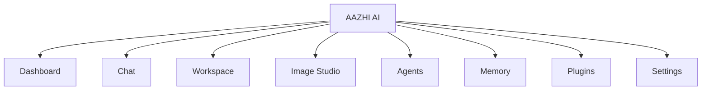

# 13. UI/UX Architecture

## UX Principles

| Principle | Meaning |
|---|---|
| Calm depth | The app should feel powerful, focused, and spacious without being decorative. |
| User control | AI memory, tools, agents, and plugins must be visible and controllable. |
| Fast workflows | Common tasks should be reachable from keyboard, sidebar, and command palette. |
| Trust through transparency | Show what context, model, tool, and memory influenced AI responses. |
| Professional polish | Designed for repeated daily use by creators, developers, and teams. |

## Navigation

## App Layout

| Region | Purpose |
|---|---|
| Left sidebar | Main navigation, workspaces, pinned chats, quick actions. |
| Top bar | Current workspace, model selector, status, search, command palette. |
| Main canvas | Active feature screen: chat, image studio, workspace, settings. |
| Right inspector | Context, memory, citations, tool calls, file details, agent steps. |
| Bottom status | Offline/online status, model status, indexing, background jobs. |

## Dashboard

| Element | Description |
|---|---|
| Recent conversations | Continue active work quickly. |
| Active workspaces | Open project contexts. |
| Model status | Local and cloud availability. |
| Memory highlights | Recent saved memories and pending approvals. |
| Agent activity | Running or paused agent tasks. |
| Plugin alerts | Updates, permission requests, disabled integrations. |

## Chat Screen

| Element | Description |
|---|---|
| Conversation list | Searchable, grouped by workspace and recency. |
| Message stream | Markdown, code blocks, images, citations, tool results. |
| Composer | Text, attachments, voice input, model selector, context picker. |
| Context drawer | Files, memories, plugins, tools, and workspace context included. |
| Response actions | Copy, regenerate, branch, save memory, forget, create task. |

## Image Studio

| Element | Description |
|---|---|
| Prompt panel | Prompt, style, references, aspect ratio, model, seed. |
| Canvas/results | Generated images, variations, edits, compare mode. |
| Asset library | Prompt history, tags, project association, export options. |
| Edit tools | Inpainting mask, reference image, crop, resize, variation. |

## Workspace

| Element | Description |
|---|---|
| File explorer | User-approved project files with indexing state. |
| Search | Keyword and semantic search. |
| Project memory | Decisions, architecture, conventions, and notes. |
| Coding assistant | Explain, generate, test, review, document. |
| Activity | Recent changes, agent actions, plugin events. |

## Settings

| Section | Controls |
|---|---|
| Models | Providers, defaults, local models, cloud API keys. |
| Memory | Enabled scopes, pending approvals, deletion, export. |
| Privacy | Cloud data policy, telemetry, redaction, offline mode. |
| Plugins | Installed plugins, permissions, updates. |
| Appearance | Theme, density, font size, language. |
| Accessibility | Reduced motion, contrast, keyboard navigation, screen reader labels. |
| Updates | Version, release channel, auto-update policy. |

## Theme

| Token Area | Direction |
|---|---|
| Primary | Deep ocean-inspired blue/teal balanced with neutral surfaces. |
| Accent | Tamil cultural warmth through restrained gold/coral accents. |
| Surfaces | Professional neutral backgrounds with strong contrast. |
| Typography | Clear global readability with optional Tamil display support. |
| Motion | Subtle, functional transitions. |

## Accessibility

| Requirement | Implementation Direction |
|---|---|
| Keyboard navigation | All major workflows accessible without mouse. |
| Screen reader support | Semantic structure, labels, live regions for streaming. |
| Contrast | WCAG AA minimum; AAA where feasible. |
| Reduced motion | Respect OS setting. |
| Font scaling | Support user-configurable UI scale. |
| Voice alternatives | Voice features must have text equivalents. |

