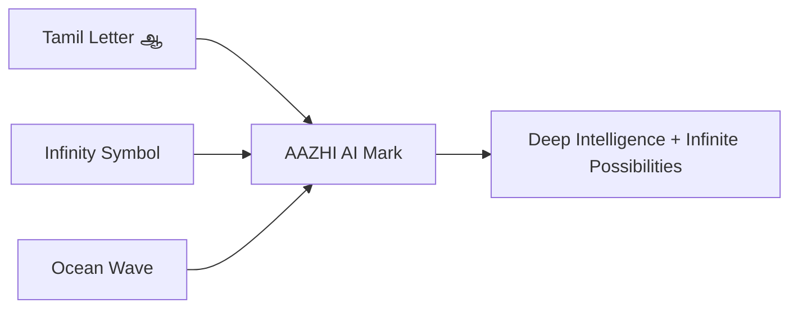

# 14. Branding

## Brand Name

**AAZHI AI (ஆழி AI)**

## Meaning

| Term | Meaning |
|---|---|
| ஆழி | Depth, vast ocean, intelligence, limitless knowledge. |
| AAZHI | Global transliteration that is memorable and pronounceable. |
| AI | Artificial intelligence platform for work, creativity, coding, and automation. |

## Brand Essence

AAZHI AI represents **deep intelligence and infinite possibilities**. The product should feel calm, capable, trustworthy, and expansive.

## Primary Logo Concept

The logo should combine:

| Element | Meaning |
|---|---|
| Tamil letter `ஆ` | Cultural identity and distinctiveness. |
| Infinity symbol | Endless learning, extensibility, and future possibility. |
| Ocean wave | Depth, flow, power, and exploration. |

## Logo Direction

## Visual Identity

| Area | Direction |
|---|---|
| Shape language | Smooth but precise; wave curves balanced with geometric clarity. |
| Color | Deep ocean, teal intelligence, neutral professional surfaces, warm accent. |
| Typography | Modern sans-serif with strong Tamil script support. |
| Iconography | Clean line icons, meaningful states, no excessive ornamentation. |
| Motion | Gentle wave-inspired transitions for loading and thinking states. |

## Brand Voice

| Trait | Description |
|---|---|
| Deep | Thoughtful, context-aware, not shallow or gimmicky. |
| Clear | Globally understandable, concise, useful. |
| Respectful | User remains in control. |
| Capable | Professional and dependable. |
| Warm | Human, calm, and welcoming. |

## Naming System

| Product Area | Possible Naming Direction |
|---|---|
| Memory | Depth Memory, Aazhi Memory, Knowledge Depth. |
| Agents | Deep Agents, Aazhi Agents. |
| Image studio | Aazhi Studio. |
| Model manager | Model Harbor. |
| Plugin marketplace | Aazhi Extensions. |

Names should be tested carefully. Cultural meaning should be used respectfully and sparingly so the interface remains globally clear.

